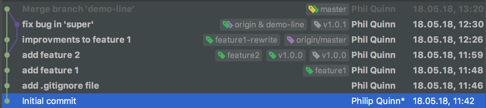

# Learning Git


This repo is intended as place to play with git commands.


## How to use git effectively

In the section i want to explain how to work with feature branches, keep
a clean master with a well preserved history and how we track production
changes.

So we start with our features:
#### Feature 1
We begin with our first feature:
```
git checkout -b "feature1"
git add .
// make changes
git commit -m "add feature 1

Feature 1 in all its glory solves that serious business issue that we
all know so much about
"
```

#### Feature 2
In the meantime someone else already started on feature 2

```
git checkout -b "feature2"
// make chagnes
git commit -am "add feature 2       (note: -a is short for all. Means no need for `git add .`but be careful with both of these)

Since we had that other customer, we needed to do that thing. So here's the thing that totally solves our problems

Problems Solved:
- Problem 1 where the stuff happened with the things
- Problem 2 where that thing happened with the stuff
"
  508  git commit -m "add feature 2

Since we had that other customer, we needed to do that thing. So here's the thing that totally solves our problems

Problems Solved:
- Problem 1 where the stuff happened with the things
- Problem 2 where that thing happened with the stuff
"
```

After commit we realized we had a typo or small bug in the branch. No
problem. We fix it (run the unit tests) and commit our change

```
git commit -am "fix typo in business"
```

### Visualization

How does this look in the version control tree?

```
(initial commit)
        |
        |
(add .gitign ore file) ---  (add feature 1)
    [master]           \       [feature1]
                        \
                    (add feature 2) -- (fix typo in business)
                                             [feature2]
```


### Merging Back To Master
While our colleague was fixing their business bug we merged our feature1
back to master. (Note: this step would normally be done on CI/CD)

```
git checkout master
git merge feature1
```

What does our tree look like now?


```
(initial commit)
        |
        |
(add .gitign ore file) ---  (add feature 2) -- (fix typo in business)
        |                                           [feature2]
        |
 (add feature 1)
[master,feature1]
```

Notice that the branch feature1 and master are on the same commit. This
is known as a [fast forward](https://ariya.io/2013/09/fast-forward-git-merge)

Okay, what about our feature2. Is it ready to merge. Well sort of, but
if we merge directly then it will have the 2 commits. In terms of master
really both commits belong together. Therefore you should squash these.

This can be done automatically in github, but I tend to do it manually
on the feature branch, as sometimes you do want to keep more than one
commit as they are independent units that can live on master.

```
git checkout feature2
git rebase master
git rebase -i HEAD~2
// Follow the prompts and instrcutions
```

```
(initial commit)
        |
        |
(add .gitign ore file)
        |
        |
 (add feature 1)   --- (add feature 2)
[master,feature1]         [feature2]
```

Now we just have one commit on our feature2 branch. But wait, what was
that sneaky `git rebase master`? This replays our changes on
top of master. Effectively this simulates us starting the work now on
top of the most recently accepted finished product.
Why is this a good thing?  This means there are no "merge
commit". A merge commit is the commit that git adds when it combines two
pieces of code - we will see an example of this later. This makes the
history hard to read as it becomes non linear. A linear history can be
very useful for debugging or working out why or when something broke.

```
git checkout master
git merge feature2
git push
git tag v1.0.0
```

Now we merge our feature2, push it to github and (after thorough
testing) we promote to production.

```
(initial commit)
        |
        |
(add .gitign ore file)
        |
        |
 (add feature 1)
    [feature1]
        |
        |
 (add feature 2)
[origin/master, master, feature2] <v1.0.0>
```

### The Development Never Stops

The business have requested some parts of feature1 be rewritten and
enhanced.

```
git checkout master
git chcekout -b "feature1-rewrite"
// make some fine changes
git commit -am "Improvments to feature 1"    (note: this does not confrom to a good commit message)
// we test, we review
git checkout master
git merge feature1-rewrite
git push
```

How does our tree look now?

```
(initial commit)
        |
        |
(add .gitign ore file)
        |
        |
 (add feature 1)
    [feature1]
        |
        |
 (add feature 2)
[feature2] <v1.0.0>
        |
        |
 (improvements to feature 1)
[origin/master, master, feature1-rewrite]
```

Alas, as soon as the push leaves your computer the product owner comes
and tells you there's an urgent issue and we need to fix something in
the demo environment being used by stakeholders. But the
new feature1 cannot go live yet. How do we deal with this? We use our tag.

```
git checkout -b demo-line v1.0.0
// make the fix
git commit -m "fix bug in 'super'         (note: this is a better message)

 We had a production issue where the thing was with an extra letter
 but this fixes it my removing that bug

"
git push -u origin demo-line
git tag v1.0.1
```

Our change has been pushed. We marked a new version and this will be
deployed to the demo environment. Note that we now need a special build
and deploy step for this 'demo-line' branch. This is not covered in this
tutorial.

### Merging The Hot-Fix back to master

Now we want to get this fix back onto our master branch.

```
git checkout master
git merge demo-line
// fix conflicts
git add .
git commit -m "Merge branch 'demo-line'

# Conflicts:
# src/package1/importantFeature.txt"
"
git push
```


Here is how our final branch looks (this time taken from the Idea version
Control)



Notice we have a merge commit where we merged the hot fix back to master
Although the spoils the linearity, it preserves the history of what
actually happened.

# Summary

We have a bunch of tools at our disposal to branch, rebase, merge and tag
our work to preserve a nice history.

There are a bunch of other (read better) tutorials out there that you
should also checkout
* [Git commit messages](https://chris.beams.io/posts/git-commit/)
* [Merging vs Rebasing](https://www.atlassian.com/git/tutorials/merging-vs-rebasing)

